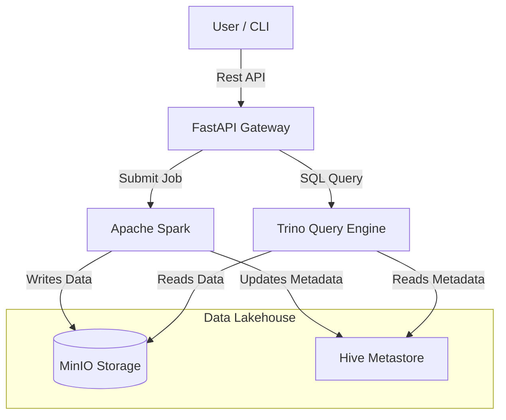

# Data Lakehouse Architecture & Technical Stack

## 1. Introduction
This document outlines the architecture, technology stack, and workflow of the Local Data Lakehouse system. This project implements a modern "Lakehouse" architecture, combining the low-cost storage of a Data Lake with the transactional reliability and performance of a Data Warehouse, all running locally on a single machine or server.

## 2. Technology Stack

| Component | Technology | Version | Purpose & Justification |
|-----------|------------|---------|-------------------------|
| **Storage Layer** | **MinIO** | Latest | **Object Storage (S3 Compatible)**. MinIO serves as the foundation of the Data Lake, storing raw files (Parquet, CSV) and transaction logs. It is chosen for its strict S3 compatibility, allowing the entire stack (Spark, Trino, Hudi) to interact with it as if it were AWS S3. |
| **Table Format (Primary)** | **Apache Hudi** | 0.14.0+ | **Transactional Layer (Write Optimized)**. Hudi (Hadoop Upsert Deletes and Incrementals) is the primary format used in this project for the ingestion and CRUD pipeline. It excels at fast upserts and incremental processing. |
| **Table Format (Secondary)** | **Apache Iceberg** | 1.4.3 | **Transactional Layer (Read/Interop Optimized)**. Used for specific endpoints (`/ingest/{table}`) to demonstrate an alternative open standard. Iceberg provides a table abstraction for huge analytic datasets and is strongly supported by the Trino ecosystem. |
| **Compute Engine (Write)** | **Apache Spark** | 3.3.4 / 3.5.0 | **Data Processing & Ingestion**. Spark is the heavy-lifting engine used to read incoming data (CSVs), process specific business logic, and write/compact data into Hudi tables. It handles the distributed processing required for Copy-On-Write operations. |
| **Compute Engine (Read)** | **Trino** (formerly PrestoSQL) | Latest | **Distributed SQL Query Engine**. Trino is used to query the data lake using standard ANSI SQL. It is incredibly fast and decouples compute from storage, allowing you to run complex analytical queries over the Hudi tables stored in MinIO. |
| **Metadata Catalog** | **Hive Metastore** | 3.1.3 | **Central Catalog**. Acts as the "Brain" of the system, tracking where tables are located and their schema evolution. It allows Spark (the writer) and Trino (the reader) to stay in sync regarding table definitions. |
| **API Layer** | **FastAPI** | Python 3.x | **Interface**. Exposes the Lakehouse capabilities via a REST API. It wraps complex Spark submissions and Trino queries into simple HTTP endpoints (`/ingest`, `/query`), making the system accessible to frontend apps or external scripts. |
| **Containerization** | **Docker & Docker Compose** | - | **Infrastructure Orchestration**. encapsulating all services (MinIO, Spark, Trino, Hive) into containers ensures a reproducible, isolated environment that runs identically on a laptop or a Linux server. |
| **Interaction** | **LakeShell (Python CLI)** | Custom | **User Interface**. A custom-built, database-like CLI that allows users to interact with the Lakehouse using simple commands (`insert`, `select`, `travel`) without needing to know the underlying API complexity. |

## 3. Architecture Diagrams

### High-Level Architecture

## 4. Components Deep Dive

### 4.1. Storage (MinIO)
- **Role**: Replaces HDFS or S3.
- **Organization**: Data is stored in buckets (e.g., `warehouse`).
- **Structure**: Inside the bucket, data is organized by table name (`warehouse/leads/`).
- **Files**:
    - `.hoodie/`: Contains timeline events (commits, cleans, rollbacks).
    - `partition=.../*.parquet`: Actual data files optimized for columnar reading.

### 4.2. Ingestion & Writes (Apache Spark + Hudi)
- **Script**: `hive_trino_setup/ingest_csv_hudi.py`.
- **Logic**:
    1.  Spark Session is initialized with Hudi bundles.
    2.  Reads raw CSV and infers schema.
    3.  Sanitizes column names (lowercase, no spaces) for compatibility.
    4.  Performs a **Copy-On-Write (CoW)** operation:
        -   Reads existing data (if any).
        -   Merges new updates based on Primary Key.
        -   Rewrites the affected parquet files + logs a new commit in `.hoodie`.
    5.  Syncs the new schema/table definition to Hive Metastore.

### 4.3. Query & Analytics (Trino)
- **Role**: The "SQL interface" for the user.
- **Logic**:
    1.  Receives SQL from API.
    2.   consults Hive Metastore to find where the `leads` table files are.
    3.  Reads the Hudi metadata to determine which files are the "latest" valid version (Snapshot Isolation).
    4.  Executes the query distributedly and returns results.

### 4.4. Multi-Format Support (Hudi & Iceberg)
One of the key strengths of this architecture is its specific support for multiple open table formats.
-   **Hudi**: Used for the main `ingest_csv_hudi.py` pipeline. We use it for high-velocity transaction support (Upserts) and near real-time ingestion.
-   **Iceberg**: Supported via the `/ingest/{table}` endpoint in `api/main.py`. This uses the `pyiceberg` library to interact directly with the Catalog, demonstrating a "Lightweight" write path that doesn't always require Spark (though Spark is used for heavy lifting).
-   **Interoperability**: Both formats coexist in the same MinIO bucket (`warehouse/`) and are both registered in the Hive Metastore, meaning Trino can query `hudi_table` and `iceberg_table` in the same SQL JOIN.

## 5. Key Features Implemented

### 5.1. ACID Transactions
Guarantees that an `insert` or `update` either fully succeeds or fails. No partial data ("dirty reads") is ever visible to Trino.

### 5.2. Schema Evolution
When you upload a CSV with *new columns*, Hudi/Spark automatically detects the schema difference and evolves the table schema in the Hive Metastore, making the new columns instantly queryable.

### 5.3. Time Travel
Every write operation creates a "Commit" on the Hudi timeline.
- **History**: We can query the timeline to see every transaction timestamp.
- **Travel**: We can query the table `AS OF` a specific timestamp to see the data exactly as it was at that moment, enabling audit trails and accidental data recovery.

### 5.4. Upserts (Update + Insert)
Unlike standard Data Lakes (which are append-only), this system supports **Updates**.
- Spark matches records by Primary Key (e.g., `Index`).
- If the key exists -> Update the row.
- If the key is new -> Insert the row.
